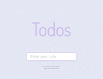
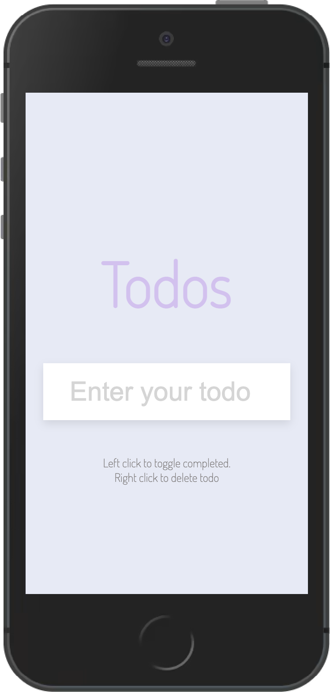

# About

This application is about a TODOS list. You can enter the todos and click on the specific todo to toggle it as completed. Also, implementing local storage when reloading the page will keep the data todos in the DOM.
When you right click will delete the specific todo.

## Application Preview
 
**Desktop version**

**Mobile Version**

